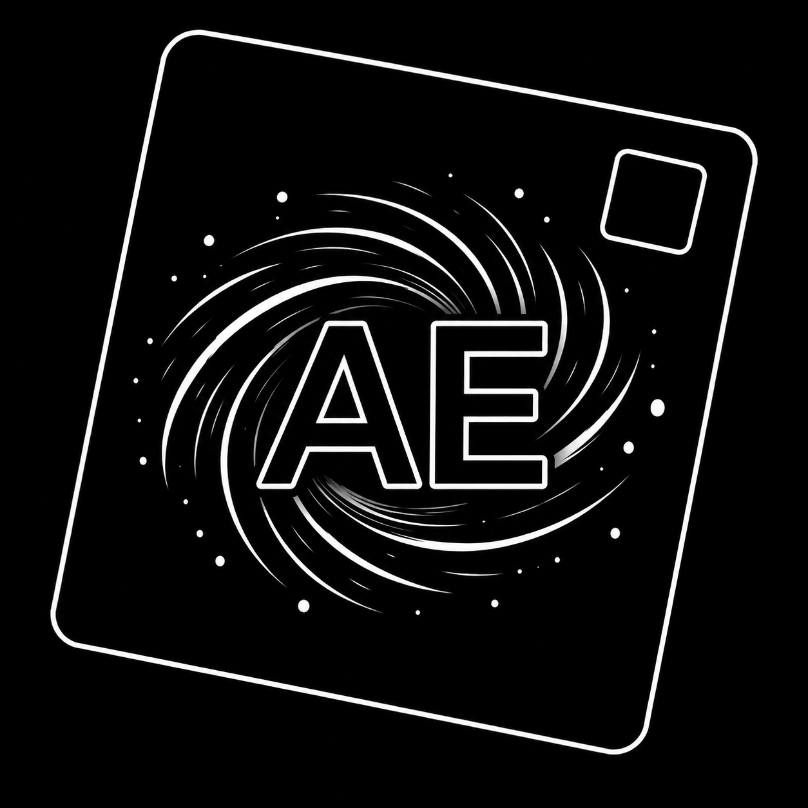

# Atomic Game Engine

<p align="center">
  
</p>

<p align="center">
  <b>A 3D game engine for developers looking for more advanced and friendly capabilities.</b>
</p>


## Features

- **C++ Engine:** Lightning fast performance and availability.
- **ECS-driven:** Entity Component System in the underlying engine.
- **Embedded Scripting:** Luau and TypeScript/JavaScript for high-level scripting and programming.
- **C++ Bindings:** Many C++ libraries with scripting bindings for all of your needs.
- **Node Systems:** Integrated node systems for graph-based operational work. Works like Blueprints.
- **Multi-Deployment:** Play singleplayer, LAN, Peer2Peer and online. The architecture supports them all.
- **Sandboxed:** You download the engine then play any game.
- **Multi-Platform:** Windows, Linux, MacOS, Android, IOS and VR.
- **Permissive License:** You can do a lot of things with this engine, with attribution of course.

## Documentation

| Read | For |
|---|---|
| **[RUNNING.md](RUNNING.md)** | **every way to build and run the client, the server, a single test and the tools** |
| [CONTRIBUTING.md](CONTRIBUTING.md) | building from a fresh clone, and what is expected of a pull request |
| [docs/CODE_QUALITY.md](docs/CODE_QUALITY.md) | the completion checklist - run it before opening one |
| [docs/CODE_FORMAT.md](docs/CODE_FORMAT.md) | naming, includes, and what a comment is for |
| [docs/CODE_DOCUMENTING.md](docs/CODE_DOCUMENTING.md) | where a comment ends up in the generated reference, and the tags |
| [AGENTS.md](AGENTS.md) | the four rules, and how AI is used here |
| [ROADMAP.md](ROADMAP.md) | what is built, what is next |
| [docs/RELEASING.md](docs/RELEASING.md) | the version scheme, and how a tag becomes a download |
| [docs/DEFERRED.md](docs/DEFERRED.md) | deferred items from ROADMAP.md that need to be revisited |
| [SECURITY.md](SECURITY.md) | the threat model, and reporting |

Each `mono.X` folder also carries its own `AGENTS.md` with the invariants
specific to it. Those are the ones that catch real mistakes, so read the one for
whatever you are about to change.

## Releases

Pushing a `vX.Y.Z` tag builds the `release` preset on Linux, Windows and macOS
and publishes what it built to the GitHub releases page:

- **Linux:** a `.tar.gz` of all four programs, plus an `.AppImage` each for the
  client and the studio
- **Windows:** a `.zip` of all four programs
- **macOS:** a `.tar.gz`, unsigned and untested

Linux is the platform this is developed on. Windows compiles but has never
shipped, and macOS has never been run, so neither one holds up a release.

Development builds and media are still in the discord server below.

## Version

Current Version: **v0.19**
Project Start Date: **1st August 2026**

Versions are `v[major].[minor].[patch]`. Everything before `1.0.0` is a
pre-release with no compatibility promise.

The number lives in one file, [`VERSION`](VERSION), and everything derives from
it - the build, the artifact names, and `--version` on any program:

```console
$ client --version
client 0.18.0
```

See [`docs/RELEASING.md`](docs/RELEASING.md) for what each number means and how a
release is cut, and [`ROADMAP.md`](ROADMAP.md) for what is in each one.

## Development Cycle

Led by [`@SPOOKEXE`](https://github.com/SPOOKEXE)

Maintained by open-source contributing developers, especially those coming from the Roblox community.

Heavy usage of AI models for fast development iteration. Refer to `AGENTS.md` and `CONTRIBUTING.md` for more information.

Refer to `ROADMAP.md` for what was done and we plan to do.

More on the discord server in the links section.

## Links


## License

[`Mozilla Public License 2.0 (MLP2.0)`](LICENSE)

