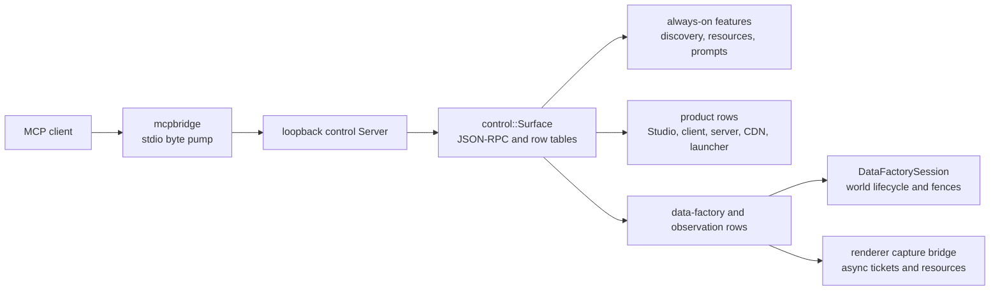
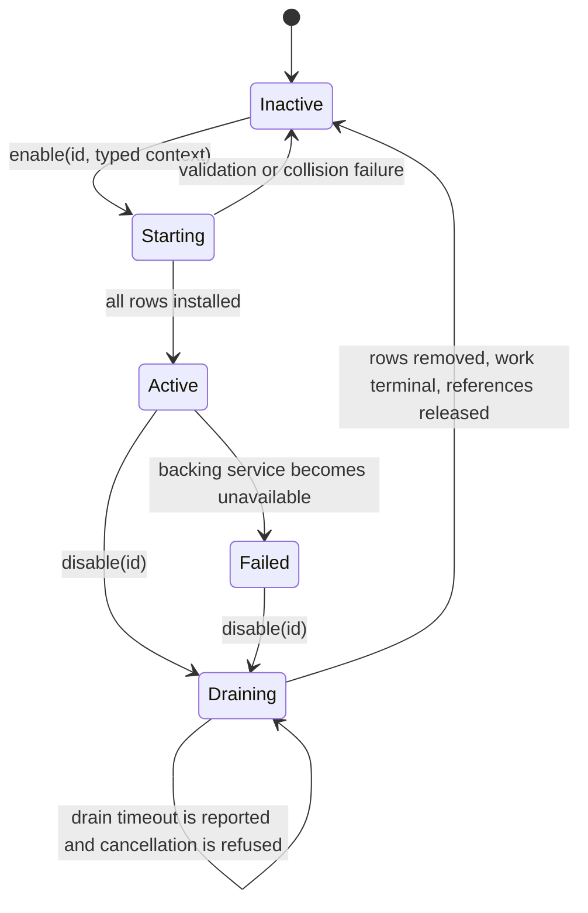

# v0.25 MCP consolidation and cleanup plan

## Decision

Keep one engine-hosted MCP surface. Keep `mcpbridge` as the byte-only stdio
adapter. Consolidate the growing product and data-factory additions behind
runtime-owned feature hooks that can be enabled and disabled safely.

Do not introduce dynamically loaded shared libraries in v0.25. Runtime loading
of native binaries adds ABI, allocator, exception, thread, and unload hazards
before the feature boundary is proven. The first form of hot loading means
installing and removing already-linked providers at runtime. A later plugin ABI
can sit outside the same provider contract once it has a concrete consumer.

The target is a small, stable control kernel with optional compiled hook
providers. A product creates the kernel once, gives it an owner-thread pump,
and activates named providers only while their backing services exist. Removal
waits for work accepted by that provider to reach a terminal state before it
removes all owned rows and releases captured references.

## Scope and sources

This plan covers the MCP control surface, not the external collector, model
training, or dataset-writer implementation.

`MCP-ADDITIONS.md` is not in this checkout. It was removed in commit
`e464d5c1`; the full historical proposal is available at
`0d0d0b4e:MCP-ADDITIONS.md`, and the current sibling handoff copy is
`../datafactories-docs/MCP-ADDITIONS.md`. Those documents are useful for
intent, vocabulary, bounded-resource rules, and acceptance ideas. They are not
an implementation inventory. Current source and
`mono.engine/control/docs/MCP.md` are the authority for what ships today.

The historical proposal is much broader than the active narrow handoff. The
active handoff is the revision-fenced `raw-scene/v1` extraction and the existing
factory lifecycle, scene observation, capture, and retained-resource rows.
Everything else must enter as a separately negotiated capability with a named
owner, bounds, lifecycle, and test plan.

## Current map



`control::Server` accepts one loopback client and pumps requests on the host
thread. `Surface::Answer` implements the MCP handshake and dispatches
`tools/*`, `resources/*`, and `prompts/*`. `mcpbridge` intentionally parses no
MCP and forwards bytes between stdio and the loopback socket. This separation is
sound and should remain.

The shared surface also registers `emulate_mouse_move`, `emulate_click`,
`emulate_mouse_wheel`, `emulate_key`, and `emulate_text` when a host supplies an
input callback. Studio, client, and launcher route these through their normal
input boundaries, including headless UI frames. A server or CDN has no pointer
or keyboard owner and does not advertise those rows. The Universe feature
exposes bounded entity creation, destruction, and component removal alongside
its existing read and write tools. Product MCP listeners remain opt-in.

Products presently assemble feature arrays themselves. Studio changes the list
when `DataFactoryHost` is present. Client conditionally adds data-factory,
audio, script-package, capture, scene, and observation rows. Server and CDN
have their own lists and custom rows. That makes capability shape depend on
several distant construction sites.

`Surface::Add`, `AddResource`, and `AddPrompt` replace an equal name or URI,
and `Enable` only invokes installers. It does not record provider ownership,
provide removal, prevent a cross-provider overwrite, or drain in-flight work.
Provider lambdas commonly borrow host services. Therefore simply erasing a row
after a host subsystem changes lifetime would be unsafe.

The largest concentration is in public feature headers: `DataFactory.hpp`
(2,150 lines), `DataScene.hpp` (1,795), and `DataCapture.hpp` (1,386). Each
mixes schemas, argument parsing, operation-ledger use, host calls, result
mapping, and row registration. This is the primary cleanup target.

## Findings to preserve

- The loopback-only, one-client control listener is a deliberate local-editor
  contract. Do not turn it into a network service as part of cleanup.
- Protocol dispatch stays in one implementation. A new bridge must not parse or
  duplicate JSON-RPC semantics.
- Stable strings cross MCP, exported resources, and external manifests. ECS
  handles, `Name::Id()`, and declaration-order numbers remain process local.
- Factory writes are fenced by instance, tick, world epoch, and world version.
  Keep those checks at every stateful boundary.
- Long operations use the bounded operation ledger and explicit polling. A
  timeout is recovered with the same operation ID and canonical arguments.
- Capture remains renderer-owned, bounded, asynchronous, and resource based.
  A hook cannot call arbitrary code from the render thread or expose mutable
  render state.
- `tools/list` and `negotiate` are the capability contract. A disabled feature
  must disappear from both, rather than remain listed and refuse later.

## Proposed structure

`mono.engine/control` is shared at L13 and `mono.engine/render` is client tier
at L12. A shared module cannot link a client module. The control kernel must
never depend on renderer headers, symbols, or providers. This is a hard tier
boundary, not a cleanup preference.

Keep the generic registry and its lifecycle implementation inside `control`,
under `src/hooks/`, where it has no renderer dependency. In v0.25, providers
remain host-local adapters. This keeps the existing tier graph intact while the
provider contract and the actual reuse boundary are proven.

Keep render capture and render inspection adapters at the client product
boundary for v0.25: `mono.client/src/ControlHooks.cpp` and the corresponding
Studio composition source own the typed renderer context and register their
providers with the shared registry. They can link both `control` and `render`
because the product is already the composition root. Do not put this adapter in
`render`, because L12 `render` cannot link upward to L13 `control`.

If equivalent host-local adapters persist after the migration, stop and design
their shared home as a separate architecture task. That design must establish a
valid tier and layer for its dependencies before code moves. This plan approves
no new adapter module. `control` remains the protocol kernel and product sources
own final host-local composition.

```text
mono.engine/control/
  include/engine/control/Surface.hpp       protocol kernel and immutable rows
  include/engine/control/HookRegistry.hpp  provider lifecycle API
  src/Surface.cpp                          JSON-RPC dispatch only
  src/HookRegistry.cpp                     ownership, activation, drain
  src/features/                            small universal features
  src/hooks/                               registry internals only

mono.client/, mono.server/, mono.studio/, mono.cdn/
  src/ControlHooks.cpp                     compose only providers this host owns
  src/ClientCaptureHook.cpp                client-only renderer adapter where applicable
```

Do not move code merely to make the tree look even. Extract one vertical slice
at a time: schema and validation first, then service adapter, then row builder.
Keep each tool name and JSON schema byte-for-byte compatible until its explicit
contract revision says otherwise.

### Kernel API

Use these value-oriented concepts. The final names can follow local style, but
their ownership rules must not change.

| Type | Responsibility | Required properties |
| --- | --- | --- |
| `HookId` | Stable provider discovery name, such as `data_factory.capture`. | String at all external boundaries. Unique per surface. |
| `HookDescriptor` | Purpose, version, dependencies, capability summary, and declared row names. | Pure metadata. Readable while inactive. |
| `Hook` | Compiled provider factory. | Creates one activation from explicit host services. |
| `HookActivation` | The installed rows, subscriptions, tickets, and teardown logic. | Owns every registration it creates. Noncopyable. |
| `HookLease` | Registry-owned active provider handle. | Generation-bearing. Idempotent close. |
| `HookContext` | Typed dependencies supplied by one product. | No generic service bag, no `void *`, no upward product dependency. |
| `HookState` | `inactive`, `starting`, `active`, `draining`, `failed`. | Queryable through discovery. |

Rows require an owner token containing the hook ID and activation generation.
`Surface` indexes tools by name, resources by URI, and prompts by name, but the
registry is the only API allowed to add or remove owned rows. A duplicate row
from another active hook fails activation with both owners named. Replacement
within an activation is prohibited. This replaces accidental last-writer-wins
with an observable configuration error.

Feature functions that are permanently small and host-independent may continue
to register through the kernel during construction. Optional features move to
host-local hooks with typed contexts. Data factory, raw scene, audio, rig,
temporal, visibility, and product rows stay with the host that already owns
their dependencies until a separate architecture design proves a shared home.
Capture, render graph, and camera-rendering-data rows remain client product
hooks, with their renderer dependency outside shared control code.

### Activation and removal contract



Activation validates the declared dependency hooks and typed context before it
publishes any row. It then builds rows privately, validates duplicate names,
installs them as one registry transaction, and publishes a changed capability
generation. A failed activation leaves the previous surface untouched.

Each tool call obtains a short-lived activation guard before invoking its
callback. Disabling first stops new guards, then invokes the provider's
`BeginDrain`. The provider cancels work that has not started, polls or completes
already-started work, releases retained resources only under existing capture
rules, unregisters callbacks, and finally removes its rows. It cannot unload
while a callback, asynchronous ticket, renderer submission, or resource reader
still holds its generation.

Use the existing bounded operation ledger and capture ticket state as the first
drain participants. Do not add a second operation tracker. `world_retire` is
allowed only after dependent hooks have drained. Renderer capture removal keeps
its current rule: pending work reaches a terminal result, then resources follow
their explicit release or TTL policy.

The host pump remains single-threaded. Cross-thread producers publish copied
terminal records into the existing bounded queues and never retain a `Surface`,
tool lambda, or host-world pointer. Unload acknowledgements return to the host
thread before row removal.

### Capability discovery

Keep MCP-standard `tools/list`, `resources/list`, and `prompts/list` as the
source for callable rows. Extend the engine `negotiate` response with:

```json
{
  "control_generation": 17,
  "hooks": [
    {
      "id": "data_factory.capture",
      "state": "active",
      "revision": "v1",
      "tools": ["capture_bundle", "poll_capture", "get_resource"],
      "limits": {"maximum_in_flight": 8}
    }
  ]
}
```

The response reports inactive optional hooks only when the caller has requested
diagnostic discovery. Normal capability discovery lists active hooks and their
actual limits. Every activation and removal increments `control_generation`.
The bridge need not change because the protocol response remains ordinary JSON.

Do not claim MCP dynamic `listChanged` support until the server can notify
connected clients correctly. During v0.25, a client refreshes `negotiate` and
the lists after an acknowledged hook operation. The kernel continues to report
`listChanged: false`.

## Consolidation matrix

| Area | Current evidence | Target hook or kernel owner | Migration and test point |
| --- | --- | --- | --- |
| JSON-RPC, tool/resource/prompt tables | `Surface.cpp` owns all standard dispatch. | `control` kernel. | Preserve response envelopes, notification behavior, and unknown-row handling with transcript tests. |
| Loopback listener and stdio bridge | `control::Server` has one client; `mcpbridge` forwards bytes. | `control` transport and `mono.tools/mcpbridge`. | Keep byte forwarding. Add host restart, early stdin close, and disabled-hook discovery integration tests. |
| Common discovery and docs resources | `Discovery`, `Resources`, `Prompts`, architecture and diagnostics features. | Built-in kernel features. | Make construction declarative and compare current schema snapshots. |
| Product rows | Studio, client, server, and CDN each call `Surface.Enable` and add custom rows. | Product `ControlHooks.cpp` composition. | Test the exact enabled-hook manifest per product and expected unavailable capabilities. |
| Factory lifecycle and replay ledger | `DataFactory.hpp`, `DataFactoryOperationLedger`, `world::DataFactorySession`. | Factory host-local hook over the existing session. | Preserve canonical-argument replay, fences, reset, retirement, pause, step, checkpoint, restore, fork, and intervention tests. |
| Raw scene reads and exports | Raw or glTF retained exports in `DataScene.hpp`. | Host-local raw-scene hook. | Test snapshot fence, byte range bounds, stable IDs, release, and teardown retention. |
| Camera rendering data | `get_camera_rendering_data` in `DataScene.hpp`. | Client or Studio product scene-rendering hook. | Test matching snapshot, epoch, view, pipeline, and renderer generation. |
| Render capture | `DataCapture.hpp`, client render bridge, tickets, resources. | Client or Studio product capture hook. | Test queued, ready, cancelled, failed, and drained tickets. Verify snapshot, epoch, view, pipeline, and resource identities. |
| Read-only observation slices | temporal, visibility, rig, audio, occupancy, SDF, and navigation rows. | One hook per independently useful service family. | Test availability, hard bounds, stale fence, unavailable reason, and no world mutation. |
| Script package and render-only operation | control adapter plus product-host callbacks. | Factory host-local package hook; client product `FactoryRender`. | Use explicit dependency on Factory. Test hook activation only when callbacks exist. |
| Renderer graph inspection | `RenderGraph.hpp` and client provider. | Client or Studio product render-inspection hook. | Test no renderer dependency in shared targets or headless products and clean removal after renderer shutdown. |

## Areas requiring investigation before moving code

1. Establish the source of truth for every advertised tool. `MCP.md`,
   `tools/list`, `negotiate`, and external typed client definitions must be
   compared automatically. The plan must resolve any name, required-field,
   limit, and error-envelope drift before an extraction changes behavior.
2. Audit lifetime capture in every existing tool lambda. Record whether it
   borrows a product, universe, factory session, renderer, resource owner, or
   callback. A hook may not outlive any borrowed service.
3. Confirm every asynchronous capture and render-only path has one terminal
   owner and a bounded release path during world retirement, renderer reset,
   client shutdown, and hook removal.
4. Audit `Surface` copy and move behavior with the shared operation ledger.
   Decide whether a runtime registry makes surfaces noncopyable or transfers
   only after all activation guards drain. Do not retain a copied live registry.
5. Measure host-thread cost of schema generation, list construction, tool
   dispatch, activation, and draining in a release build. Schema work must not
   cause a visible frame or tick hitch.
6. Check whether currently reported `listChanged: false` remains correct after
   runtime activation. If not, implement notifications as a separate protocol
   feature with a real MCP client test.
7. Reconcile the historical broad contract with current capability names. Do
   not implement proposals such as generic scene editing, multi-camera atomic
   GPU claims, dynamic plugin loading, or new channels merely because they
   appear in `MCP-ADDITIONS.md`.

## Staged migration

### Stage 0: inventory and compatibility baseline

Generate checked JSON manifests for Studio normal, Studio factory, client
normal, client factory, server factory, server normal, and CDN. Each manifest
contains server info, feature or hook IDs, tools with input schemas, resources,
prompts, negotiated capabilities, limits, and unavailable reasons. Store only
reviewed source fixtures, never generated output under `.cache`.

Build direct `Surface` transcript tests and subprocess tests through
`mcpbridge`. The baseline must cover initialization, notification suppression,
unknown calls, a valid tool, a refused tool, resource and prompt reads, and a
large forwarded message. Capture raw factory, lifecycle, and capture flows with
their explicit identity fields.

Gate: all current tests pass and the manifests are accepted as the compatibility
contract. Any intentional difference requires a contract revision and migration
note before code moves.

### Stage 1: add owned registration without changing products

Introduce owner-tagged registration, activation guards, atomic registration
transactions, and a test-only hook. Keep the existing `Feature` API as an
adapter that installs one built-in activation at startup. No existing product
changes its feature list in this stage.

Gate: duplicate ownership fails before publication; a failed activation leaves
the old lists unchanged; tool dispatch holds a guard; removal waits for a held
guard; repeated disable is safe; all baseline transcripts are identical.

### Stage 2: move optional slices behind host-local hooks

Extract rig export, visibility, temporal sample, audio observation, and other
families one at a time behind host-local providers. Each provider has a tiny
typed context and declared limits. Put schemas, parsing, and service adaptation
in separate translation units in the owning host. Do not create a shared module
until a separate architecture design names valid dependencies and layer.

Gate per slice: schema snapshot equality, direct behavior tests, unavailable
host test, activate-call-disable test, shutdown during pending read test,
`server` configure, and `just check-server-is-headless`.

### Stage 3: split data-factory lifecycle from its row adapter

Keep `world::DataFactorySession` as the authoritative lifecycle service.
Extract only the MCP parsing, canonicalization, reply conversion, and
operation-ledger wrapper from `DataFactory.hpp`. The lifecycle hook owns its
rows, but never duplicates factory state or the ledger.

Gate: all world creation, reset, pause, resume, step, snapshot, checkpoint,
restore, fork, seek, intervention, and retire tests retain their present
outcomes. Test same operation ID with equal and unequal canonical arguments
before and after hook reactivation.

### Stage 4: extract scene and capture safely

Move raw scene export and client rendering rows separately through their owning
host adapters. Keep camera rendering data and capture in client and Studio
product adapters. Move capture only after its ticket, resource, renderer reset,
and world-retirement ownership graph is written and tested. The capture provider
must report `draining` while it has tickets and must deny new submissions. It
registers through the shared registry, but `control` retains no renderer type.

Gate: test pending, ready, cancelled, failed, and released tickets; provider
disable during each state; stale revisions; pipeline-generation reuse; capture
resource reads after terminal completion; and no external call on render thread.
Run `just data-capture-hook-bench` and a release capture profile before and
after this stage with the same scene, backend, resolution, and channels. Verify
the server and CDN target graphs remain free of the client capture adapter.

### Stage 5: centralize host composition and retire compatibility wrappers

Replace each product's scattered arrays and custom registration calls with one
manifest builder in `ControlHooks.cpp`. It supplies typed product services and
decides its default active hooks. Delete the legacy feature installers only
after every caller uses a hook provider. Keep no shadow registration path.

Gate: product manifests match Stage 0 except approved changes; `dev`, `server`,
and `ci` builds pass; `just check-server-is-headless` and
`just check-cdn-is-bare` pass; launch and shutdown smoke coverage shows no
retained hook, ticket, socket, or resource.

### Stage 6: decide whether a plugin ABI is justified

Only start this stage after at least two independently developed compiled hooks
need runtime binary replacement. Define a narrow C ABI with version negotiation,
allocator ownership, no exceptions across the boundary, no raw host pointers,
and an explicit unload barrier. Load each binary from an allowlisted local path
with an observable manifest. A plugin that cannot drain never unloads.

Gate: process-isolated ABI tests, incompatible-version refusal, malformed
manifest refusal, activation rollback, plugin crash containment strategy, and
repeated load-call-disable-unload soak. If these are not needed, retain the
compiled-hook design and do not add this stage.

## Verification matrix

| Risk | Required evidence |
| --- | --- |
| Wire compatibility | Golden JSON-RPC transcripts through `Surface` and `mcpbridge`; schema and capability manifests per host mode. |
| Wrong capability advertised | Active hook list and `tools/list` agree; disabled rows are absent; unavailable reason is explicit only where discovery requires it. |
| Name collision | Activation transaction rejects duplicate tool, resource, or prompt ownership with both hook IDs. |
| Use after free on removal | Deterministic held-guard test plus pending ticket, renderer reset, world retire, host shutdown, and repeated disable tests. |
| Duplicate mutation | Ledger tests prove equal canonical operation replay and unequal arguments refusal across restart or reactivation boundaries. |
| Stale world or render data | Fuzz or table tests for instance, tick, epoch, version, snapshot, pipeline revision, view slot, and ticket generation mismatches. |
| Resource leak | Bounded in-flight, cancellation, terminal release, TTL, and shutdown tests. Run a targeted heap soak for repeated capture activation and removal. |
| Render-thread violation | Instrumented assertion or test seam proves hooks only enqueue copied records and render threads never invoke external provider code. |
| Frame or tick hitch | Release benchmarks for list, activation, dispatch, capture submission, and drain. Record allocation counts and worst case duration. |
| Product layering drift | `just test-architecture`; both `dev` and `server` configure and build; `just check-server-is-headless`; `just check-cdn-is-bare`; and a graph assertion that shared `control` has no client-tier or `render` edge. |

## Completion criteria

v0.25 cleanup is complete when:

1. The current advertised MCP contract is captured by reviewed manifests and
   transcript tests for every supported host mode.
2. `Surface` has explicit, owner-tagged, transactional registration and safe
   removal with no unowned callback path.
3. Data-factory, raw-scene, observation, camera rendering data, capture, and
   render inspection functionality is represented by independently removable
   host-local hooks, with no reverse dependency from shared control code into
   `render`.
4. Every hook has a typed context, declared dependencies, limits, lifecycle
   state, and a named owner for asynchronous work and retained resources.
5. Product composition has one local manifest per product, with no duplicate
   registration lists or compatibility pathways.
6. Direct engine, stdio bridge, lifecycle, renderer capture, shutdown, memory,
   performance, architecture, and headless verification gates pass.
7. `mono.engine/control/docs/MCP.md` describes the final active capabilities,
   hook lifecycle, and client refresh behavior, while historical proposals are
   clearly marked as proposals rather than shipped behavior.
