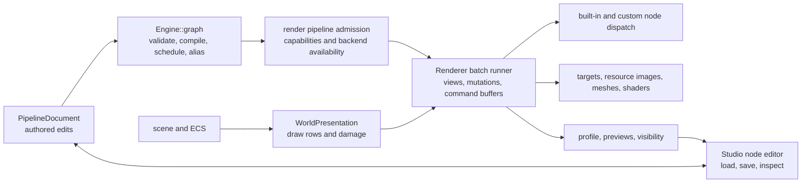

# v0.25 render pipeline cleanup plan

## Purpose

The render path has become capable enough that its main cost is now understanding where a decision belongs.
This plan makes graph meaning, render execution, GPU lifetime, world presentation, and Studio authoring explicit
ownership areas. It is a cleanup plan, not a proposal to replace the renderer or change the authored pipeline
format.

The first rule is to preserve a working renderer after every move. Extract private implementation units inside
`mono.engine/render` before considering a new module. The current `render` dependency closure deliberately owns
the SDL device, shaders, resources, and presentation adapters. Splitting it into libraries before stable cut
points exist would add architecture edges without reducing the work needed to understand one frame.

## Implementation status

The cleanup has delivered the private compiler, registry, and executor package, with compiler and renderer
admission parity tests. `FrameBatch` and `GraphResourceCache` now own their frame and resource lifetimes.
Presentation helpers isolate collection and damage work. The Studio document adapter and its canvas, inspector,
schedule, and profile panels are separated. Portal owner grouping and the host operation boundary make the
topology, demand, capture, composition, and residency paths explicit. Focused tests cover these extracted seams.

Remaining limitations:

- Final GPU test approval is pending.
- `PortalImageRuntime` still owns direct `Renderer` capture and upload calls.
- Full CPU CI gates are blocked by unrelated concurrent GUI work.

The original investigations remain investigation items unless their own focused evidence closes them.

## Baseline map

At the start of this cleanup, the ownership direction was sound: `mono.engine/graph` was device free and
`mono.engine/render` consumed its compiled result. The implementation did not consistently retain that boundary:

| Area | Current source | Cleanup concern |
|---|---|---|
| Graph model and static planning | `mono.engine/graph/include/engine/graph/RenderGraph.hpp`, `src/RenderGraph.cpp`, `src/Schedule.cpp`, `src/ExecutionPlan.cpp` | The graph holds validation, scheduling, alias planning, and profile types, but renderer admission repeats part of this policy. |
| Node vocabulary | `mono.engine/graph/src/PipelineCatalogue.cpp` | Catalogue metadata is separate from the renderer's backend dispatch table in `mono.engine/render/src/RenderPipelines.cpp`. |
| Pipeline admission and execution setup | `mono.engine/render/src/RenderPipelines.cpp` | One 2,450 line file compiles, checks, partitions, installs, retains, and dispatches pipelines. |
| Frame orchestration | `mono.engine/render/src/Renderer.cpp`, `src/RendererState.hpp` | One 2,896 line file owns batch setup, grouping, hook mutation, targets, history, submission, and recovery. |
| World to draw rows | `mono.engine/render/src/WorldPresentation.cpp`, `src/ViewportFrames.cpp` | Incremental cache invalidation is tightly coupled to a positional revision array and duplicated component lists. |
| Pipeline authoring UI | `mono.studio/src/RenderPipeline.cpp`, `src/RenderPipelineGraph.cpp` | Editor load/save reconstructs the document separately from graph build and shows several inspector views from one stateful file. |
| Portal rendering | `src/PortalImageRuntime.cpp`, `src/PortalImageHost.cpp`, `src/PortalExchange.cpp`, `src/PortalCaptureTree*.cpp` | This is a distinct state machine spread across transport, ownership, preparation, composition, and renderer calls. |

The line counts are a prioritisation signal only. `PortalImageRuntime.cpp` is about 3,900 lines, `Renderer.cpp`
about 2,896, `RenderPipelines.cpp` about 2,450, `WorldPresentation.cpp` about 1,997, and
`RenderPipeline.cpp` about 1,025. Moves need to follow cohesive state and tested behaviour, not file size alone.

## Target ownership

Keep public `Renderer` as the device-facing façade. Its private implementation should have these named owners:

| Private area | Responsibility | Candidate files |
|---|---|---|
| `PipelineCompiler` | Convert an installed `RenderGraph` into one immutable execution package. Validate graph, schedule, backend support, capability requirements, command-buffer plan, aliases, entity nodes, and retained-node metadata in one result. | `src/PipelineCompiler.hpp/.cpp` extracted from `RenderPipelines.cpp` |
| `PipelineRegistry` | Install, replace, resolve, snapshot, revision, and retire named execution packages. | `src/PipelineRegistry.hpp/.cpp` |
| `FrameBatch` | Own one `Renderer::Render` batch from command acquisition through submit or abort. It owns view ordering, group state, hook mutations, lighting restoration, and history commit or discard. | `src/FrameBatch.hpp/.cpp` extracted from `Renderer.cpp` |
| `RenderNodeExecutor` | Map a node kind to executable backend work. The built-in table, custom node registration, and missing-kind reporting live together. | `src/RenderNodeExecutor.hpp/.cpp` |
| `GraphResourceCache` | Own graph resource images, history generations, alias-backed allocation, previews, and release. | Extract from `RenderTargets.cpp`, `ResourceImage.cpp`, and `RendererState.hpp` only after its lifecycle is specified. |
| `PresentationCollector` | Turn ECS and scene state into presentation rows, damage, and viewport frames. | Private files around `WorldPresentation.cpp` and `ViewportFrames.cpp` |
| `PortalRenderCoordinator` | Coordinate portal demand, topology, transport, image residency, and tree composition. It calls `Renderer` through a narrow private operation interface. | Private headers around existing `Portal*.cpp` files |

These are folders and private headers, not new public modules. For example, `src/pipeline/`, `src/frame/`,
`src/presentation/`, and `src/portal/` improve locality without widening the engine graph. Do not move generic
GPU wrappers out of `render` until a second, real device consumer needs them.

## Prioritised work

### P0: establish contracts before moving code

1. Define an immutable private `InstalledPipeline` result produced by one compiler entry point. It must contain
   the `graph::RenderGraph`, `CompiledGraph`, `ExecutionSchedule`, `ResourceAliasPlan`, planned command buffers,
   entity-node set, retained-node metadata, pipeline name, and revision.

   Extract the duplicated assembly now in `Renderer::InstallEngineDefault` and the named-pipeline installation
   paths in `mono.engine/render/src/RenderPipelines.cpp`. `Renderer::RenderGraphSnapshot` in
   `mono.engine/render/include/engine/render/Renderer.hpp` should be made from this package, rather than being a
   second manually maintained projection.

2. Make backend support a first-class compiler input. Today `CompileRenderPipeline` builds a local `NodeTable`,
   adds custom kinds, then checks missing kinds. Keep `NodeCatalogue` in `Engine::graph` as authoring metadata and
   inject a `RenderNodeExecutor` capability table from `render`. Do not add SDL or render dependencies to graph.

3. Give pipeline admission one failure type that preserves the offender, stage, and reason. Existing callers
   currently shuttle `core::Name` plus a string through multiple graph and renderer APIs. A value result makes
   Studio, MCP, logs, and tests describe the same refusal.

4. Characterise the current default PBR graph before extraction. Compare its document, compiled order, execution
   waves, command-buffer plan, alias plan, retained nodes, and profile schema. This is the baseline for every P0
   move.

### P1: separate planning from frame execution

1. Extract `PipelineCompiler` and `PipelineRegistry` without changing the public `Renderer` API. Delete the old
   helper paths after all install callers use the package. Avoid a base class or a generic pass framework.

2. Extract `FrameBatch` from `Renderer::Render`. Give it explicit terminal outcomes: skipped before acquisition,
   submitted, submitted after a recoverable view failure, and aborted. Move cleanup for `BatchActive`, command
   ownership, pending graph history, visibility snapshots, mutation restoration, and lighting restoration into
   that owner.

3. Split `RenderPipelines.cpp` by ownership: compiler and registry first, then executor and built-in pass family
   bindings. Keep pass algorithms in existing focused files such as `ScenePasses.cpp`, `InterfacePass.cpp`,
   `RenderParticles.cpp`, and `RenderLod.cpp`.

4. Rename vague internal terms when extracted. Prefer `InstalledPipeline`, `PipelineCompiler`,
   `FrameBatch`, `FrameViewGroup`, `GraphResourceCache`, and `PortalRenderCoordinator`. Retire `Impl::NamedPipeline`
   once the registry takes ownership. Do not rename public authored node kinds or pipeline document fields in this
   cleanup.

### P1: make presentation invalidation declarative

1. Replace `WorldPresentation::SourceRevisions` and its matching enum in
   `mono.engine/render/src/WorldPresentation.cpp` with named revision fields or a single declared table that owns
   the component type, revision slot, and full versus pose damage class. The present v0.25 LOD change expands the
   array from 14 to 15 and adds matching calls in several locations. It works, but future omissions compile.

2. Put the drawable component collection and `scene::ApplyDrawRenderState` input list behind one private
   `PresentationSource` function. `ViewportFrames.cpp` currently has another explicit component tuple. The goal is
   one declaration that supplies both viewport copying and world presentation collection.

3. Keep `WorldPresentation` as the boundary from ECS to copied draw data. Do not push GPU resource handles into
   scene components or give graph code renderer residency responsibilities.

4. Extract damage calculation, source-row collection, skin pose collection, and final row ordering into private
   files only after tests pin each contract. The current 1,997-line implementation should become a coordinator,
   not a collection of unrelated static helpers.

### P2: remove duplicated document and editor projection rules

1. In `mono.studio/src/RenderPipelineGraph.cpp`, isolate conversion between `graph::PipelineDocument` and
   `nodegraph::Graph` in a small adapter with a round-trip contract. Keep nodegraph layout data as authoring edits,
   and keep graph validity in `Engine::graph`.

2. Split `mono.studio/src/RenderPipeline.cpp` into document session state, canvas actions, inspector, schedule
   panel, profile panel, and resource preview bridge. `DrawRenderPipeline` should coordinate these pieces and not
   also contain save policy and diagnostics formatting.

3. Consolidate label, scope, resource lifetime, resolution, and parameter conversion helpers. The Studio adapter
   should use `NodeCatalogue` names and metadata whenever possible. It must not create a second schema for a
   render node.

4. Keep `PipelineDocument` as the canonical persisted representation. Do not persist nodegraph runtime IDs,
   compiled schedules, alias placements, previews, or process-local `core::Name::Id()` values.

### P2: make portal coordination comprehensible

1. Preserve the following state and ownership boundaries before moving code. Each row has one owner and one
   terminal retirement operation; helpers may request retirement but must not free another row's state directly.

   | State | Sole owner | Retirement operation |
   |---|---|---|
   | Endpoint validity | `PortalTopologyHost` | `PortalTopologyHost::RemoveWorld` removes the source, destination, and producer endpoint records for a world. |
   | Demand | `PortalImageHost::Impl::Source::Portals` | `PortalImageSource::InvalidatePortal` revokes a portal demand before `RetireCompositions` observes and removes its dependent composition. |
   | Source capture | `PortalImageSource` | `PortalImageSource::Clear` cancels outstanding uploads and releases every preview and capture lease. |
   | Prepared body | `PortalImageHost::Impl::PreparedBodies` | `Renderer::CancelPortalCaptureTreePreparation` cancels the preparation before the host erases the body record. |
   | Shadow route | `PortalImageHost` | `ReleaseShadowRoute` releases the route and sends its cancellation before the record is discarded. |
   | Composition job | `PortalImageHost::Impl::Source::Compositions` | `RetireCompositions` releases its route and preparation, then calls `Renderer::DropPortalImage`. |
   | Resident image lifetime | `PortalResidentImages` | `PortalResidentImages::Expire` cancels the resource-image token at its deadline and erases the entry. |

   `PortalImageHost::Clear` is the shutdown path: it retires bodies, sources, producers, resident images, and
   topology in that order. `Renderer::CancelPortalCaptureTreeComposition` remains the renderer-side terminal
   operation for an in-flight composition, including its imported shadow and node images.

2. Group existing portal files by that state machine under `src/portal/`, preserving private includes and the
   render module boundary. Move a state and its tests together in small changes.

3. Narrow portal calls into `Renderer` to explicit operations for capture, composition, upload, polling,
   cancellation, and release. The coordinator should not reach through general renderer state.

4. Keep copied `world::PresentationAddress` traffic at this boundary. Do not introduce shared world or ECS
   pointers into portal work.

## Investigations required before behaviour changes

These are review findings, not confirmed defects. Reproduce or disprove each one with a focused test and a trace
before changing logic.

| Investigation | Evidence and risk | Required evidence |
|---|---|---|
| Scheduler producer choice follows authored node order | `mono.engine/graph/src/Schedule.cpp` chooses the last earlier writer while building reader dependencies. The result is valid only if author order is intentionally the write version contract, including writes in different execution waves. | A matrix of multi-writer, reader, disabled-node, history, and each scope combination. Assert schedule edges and rendered or mock execution output. |
| Graph compiler and renderer compiler can drift | `RenderGraph::Compile`, `CompileSchedule`, and renderer-local `CompileRenderPipeline` each partition or validate different aspects. A new node kind or capability rule can be accepted by the editor then refused only on install. | Table-driven parity tests that assert the same graph status, offender, and stage for graph-only and renderer admission cases. |
| Catalogue metadata and backend dispatch are separate registries | `PipelineCatalogue.cpp` registers node definitions, while `RenderPipelines.cpp` has backend availability logic. A registered node can be authorable but not executable, or executable support can omit user facing metadata. | Test every built-in catalogue kind against the executor and every executor kind against the catalogue, with explicit exemptions for private test kinds. |
| Pipeline document round trip can lose intent | Studio reconstructs authored nodes from a linear edit stream in `RenderPipelineGraph.cpp`; engine `Build` consumes the same stream in `PipelineDocument.cpp`. Group, comment, mute, preview, resource settings, binding order, and malformed partial edits need exact preservation rules. | Golden document round trips through load, graph edits, and save. Compare canonical edits and validate the rebuilt engine graph. |
| Frame early exits may leave batch-owned state asymmetric | `Renderer::Render` has several returns before and after command acquisition, then manages history, visibility, hooks, lighting, and command submission. This is a high-risk cleanup seam even if current code is correct. | Inject failure after each acquisition and each group transition. Assert one submit or explicit abort, cleared active state, correct history disposition, visibility invalidation, and restored lighting and mutations. |
| Presentation cache tracking is index coupled | The v0.25 diff adds `LODSettings` by changing an array count, enum, invalidation call, and state application. A future mismatch can silently stale draw rows. | Per-component mutation tests generated from the declaration table, including add, remove, change, first frame, and unchanged second frame. |
| LOD GPU layout and shader stay lockstep | v0.25 changes `GpuLodSelection` from 80 to 96 bytes and adds `MinimumDistances` consumed by `lod-select.comp`. C++ `static_assert` alone cannot check shader offsets or semantic results. | GPU fixture with override, inherited zeros, invalid override, non-uniform transform, and expected selected levels. Validate reflected offsets when the shader tooling exposes them. |
| Portal retirement paths are complete | `PortalImageHost.cpp` retires compositions based on route, preparation, endpoint, and capture state. Cancellation and release ordering is complex and crosses several portal files. | Model-based sequence tests for endpoint replacement, producer removal, timeout, cancellation during upload, repeated demand, and shutdown. Track each image and job for exactly one terminal release. |

## Test plan and gates

Keep focused tests beside their owners. The repository already has useful seams:

| Contract | Existing starting suites | Add or strengthen |
|---|---|---|
| Graph validity, schedule, aliases, documents, diagnostics, profiles, layout | `mono.engine/graph/tests/RenderGraph.cpp`, `PipelineDocument.cpp`, `PipelineCatalogue.cpp`, `EngineGraph.cpp`, `PipelineDiagnostics.cpp`, `PipelineProfile.cpp`, `PipelineView.cpp` | Compiler result snapshots, catalogue-executor parity, multi-writer scheduling, document canonical round trips. |
| Renderer pipeline admission and graph history | `mono.engine/render/tests/GraphRunner.cpp`, `GraphHistory.cpp`, `Passes.cpp`, `CustomNodes.cpp`, `Capabilities.cpp`, `ResourceImage.cpp` | Install replacement, failed admission preservation, revision and snapshot consistency, alias and retained-resource retirement. |
| Frame cleanup and visible output | `HardRender.cpp`, `HardRenderGpu.cpp`, `RenderStageProbe.cpp`, `RenderImageComparison.cpp`, `VisibilityObservation.cpp` | Failure-injection state machine test and a small golden default PBR image fixture. Keep GPU checks opt-in and deterministic. |
| Presentation and viewports | `WorldPresentation.cpp`, `PresentationDamage.cpp`, `PresentationSchedule.cpp`, `ViewportFrames.cpp` | Declaration-table invalidation cases and copy parity between viewport and collector. |
| Portals | `PortalImageHost.cpp`, `PortalCaptureTree*.cpp`, `PortalExchange.cpp`, `PortalTopologyHost.cpp`, `PortalResidentImages.cpp` | State-transition ledger tests and full terminal-release sequences. |
| Studio | `mono.studio/tests/RenderPipelineGraph.cpp`, `NodeGraph.cpp`, `Presentation.cpp` | Document round-trip golden tests, inspector status rendering, schedule and profile display snapshots. |

Every extraction change must pass its narrow suite first, then the normal repository gates in `docs/CODE_QUALITY.md`:

1. `just format-check`
2. `cmake --preset dev` and `cmake --build .cache/build/dev -j`
3. `cmake --preset server` and `cmake --build .cache/build/server -j`
4. `ctest --output-on-failure` in both build directories
5. `just check-server-is-headless`, `just test-architecture`, and `just components-check` when components change
6. `cmake --preset ci` and `cmake --build .cache/build/ci -j`

For rendering changes, run a headless GPU suite only at the final verification stage with user approval, as the
repository instructions require. Record the preset, backend, fixture, dimensions, and tolerance. Profile a
release build before claiming a runtime improvement; extraction alone is not a performance change.

## Delivery order

1. Land characterisation tests and the immutable pipeline package with no output change.
2. Extract compiler, registry, and executor. Delete old installation helpers in the same changes.
3. Extract `FrameBatch` behind identical `Renderer::Render` behaviour and failure-injection tests.
4. Replace positional presentation invalidation with the declared source table, then split collector helpers.
5. Separate the Studio adapter and panels with document round-trip tests.
6. Map portal state, then move one lifecycle owner at a time with terminal-release tests.
7. Reassess whether any private area has earned its own engine module. Add one only if it has a stable public API,
   at least two consumers, and an allowed layer edge recorded in `mono.tools/architecture/expected_graph.json`.

## Explicit non-goals

- Do not rewrite the linear `PipelineDocument` format in v0.25. First prove canonical round trips and isolate its adapter.
- Do not replace the graph with a generic render-graph framework.
- Do not move SDL, shader compiler, or GPU types into public headers.
- Do not merge graph planning into renderer. The existing device-free `Engine::graph` layer is valuable and should become clearer.
- Do not mix this cleanup with new visual features, pipeline schema changes, or a portal protocol redesign.
